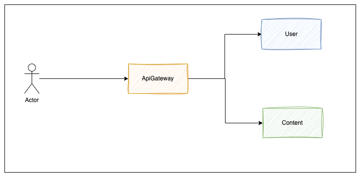

# DayPlan ApiGateway

## 1. 서버의 역할 및 설명
- ApiGateway는 요청의 방파제 및 헤더 변경, 라우팅 하는 역할을 수행해요!

<br/>

## 2. ApiGateway 



- ApiGateway는 클라이언트 요청의 맨 앞단에서 다른 서버를 지켜줄 수 있는 방파제 역할을 수행해요.
- AuthorizationHeader 및 RefreshToken 헤더를 UseId로 파싱하고 라우팅 하는 역할을 수행해요.
- 이전에 수행했던 [라이어 게임](https://github.com/Liar-Dev) 프로젝트에서는 ApiGateway에서 토큰의 유효성, 유저 유효성까지 판단하였어요.
- 해당 프로젝트는 보다 라우팅 요청 방파제 및 헤더 변경, 라우팅 역할에 초점을 맞추고 유저 유효성은 유저 서버에서 판단하도록 역할을 분배하였어요.

<br/>

## 3. 헤더 변경
- 클라이언트는 인증된 사용자의 모든 요청에 대해 Authorization Header에 인증 토큰을 "Bearer " 형태로 전달해요.
- ApiGateway는 인증이 필요한 uri에 대해 Authorization Header의 jwt 토큰을 파싱하여 UserId로 바꾸는 작업을 진행해요.

``` kotlin
    override fun apply(config: AuthorizationConfig): GatewayFilter = GatewayFilter { exchange, chain ->
        val request = exchange.request
        log.info("header request = ${request.uri}")

        if (isWhiteList(request.uri.path)) return@GatewayFilter chain.filter(exchange)

        try {
            val accessToken = config.validateAuthorizationHeaderAndGetAccessToken(request)
            val userId = tokenParser.parseUserIdFromToken(accessToken, HeaderType.AUTHORIZATION_HEADER)

            val modifiedRequest = exchange.request.mutate().header("UserId", userId).build()
            return@GatewayFilter chain.filter(exchange.mutate().request(modifiedRequest).build())

        } catch (e: JsonProcessingException) {
            return@GatewayFilter errorFilter.onError(exchange, e)
        } catch (e: GatewayException) {
            return@GatewayFilter errorFilter.onError(exchange, e)
        }
    }

    private fun isWhiteList(requestURI: String): Boolean {
        return WHITE_LIST.any { antPathMatcher.match(it, requestURI) }
    }
```
<br/>

## 4. 요청의 방파제
- 클라이언트의 요청이 적절하지 않는 경우 (Not Found, Bad Request 등) 에러 필터를 통해 요청을 차단하는 역할을 수행해요.
``` kotlin

    @Component
    class ErrorFilter {
    fun onError(exchange: ServerWebExchange, exception: Exception): Mono<Void> {
        val response = exchange.response
    
        val exceptionResponse: ExceptionResponse
    
        when(exception) {
            is JsonProcessingException -> {
                response.setStatusCode(HttpStatus.BAD_REQUEST)
                exceptionResponse = ExceptionResponse(
                    status = GatewayExceptionCode.BAD_REQUEST.status,
                    code = GatewayExceptionCode.BAD_REQUEST.errorCode,
                    message = GatewayExceptionCode.BAD_REQUEST.message
                )
            }
```

## 5. 요청 라우팅
- internal에 대한 클라이언트 요청은 모두 차단해요.
``` kotlin
    @Bean
    fun setRoutes(
        builder: RouteLocatorBuilder,
        authorizationHeaderFilter: AuthorizationHeaderFilter,
        refreshTokenHeaderFilter: RefreshTokenHeaderFilter,
    ): RouteLocator {

        return builder.routes()
            .route("block-internal") { route ->
                route.path(
                    "/user/internal/**", "/content/internal/**"
                )
                    .filters { spec -> spec.filter(blockInternalRequestFilter()) }
                    .uri("forward:/invalid")
            }
```
<br/>

- 반면, Authorization Header가 없는 로그인 요청은 필터 없이 통과해요.
- 인증 토큰 재발급처럼 Authorization Header의 인증 토큰이 만료된 경우 RefreshToken에 대한 유효성을 처리할 수 있도록 라우팅 순서를 조정하였어요.
``` kotlin
    .route("user") { route ->
        route.path("/user/registration/social/**")
            .uri(userServerUri)

    }.route("user-reissue") { route ->
        route.path("/user/authentication/reissue/accesstoken")
            .filters { spec -> spec.filter(refreshTokenHeaderFilter.apply(authorizationConfig)) }
            .uri(userServerUri)
```
<br/>

- 나머지 요청에 대해서는 AuthorizationHeaderFilter를 적용한 후 라우팅해요.
``` kotlin
    }.route("user-general") { route ->
        route.path("/user/**")
            .filters { spec -> spec.filter(authorizationHeaderFilter.apply(authorizationConfig)) }
            .uri(userServerUri)

    }.route("content-general") { route ->
        route.path("/content/**")
            .filters { spec -> spec.filter(authorizationHeaderFilter.apply(authorizationConfig)) }
            .uri(contentServerUri)
    }
    .build()
```

## 6. 반드시 개선이 필요한 TODO
- 현재 다른 서비스 및 안드로이드 개발로 인해 각 서버를 헬스 체크하는 기능이 늦어지고 있어요.
- wireMock 테스트를 적극 사용하여 신뢰할 수 있는 코드를 작성하고자 해요.